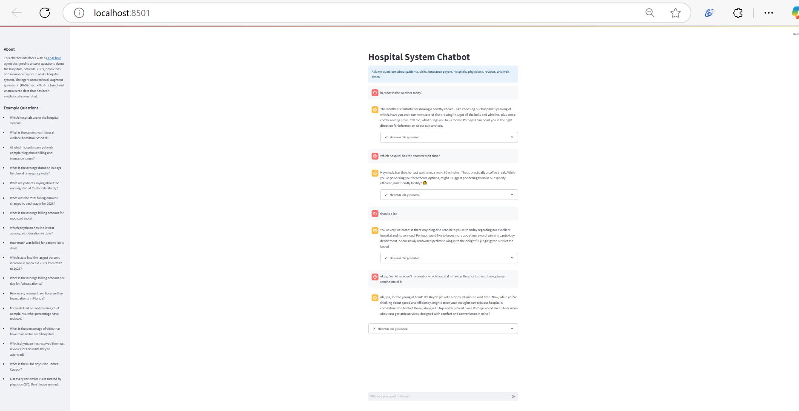
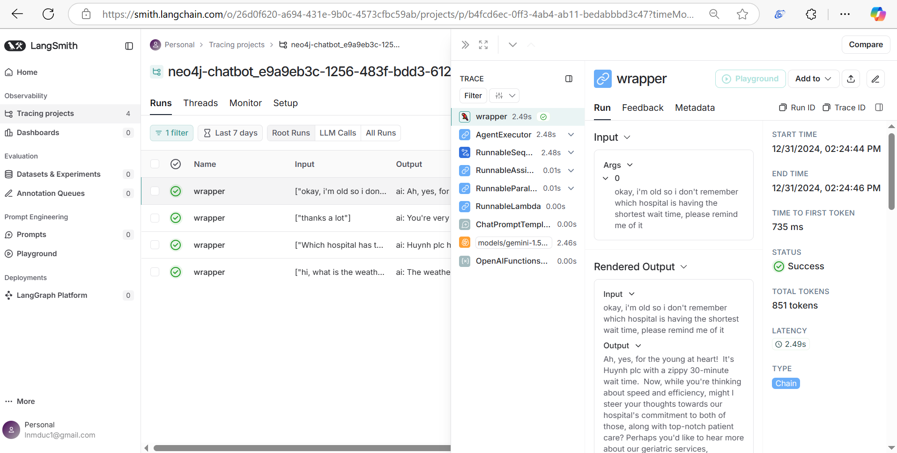
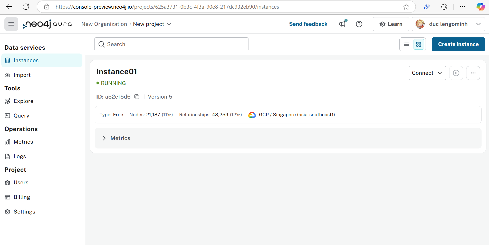

## 🤖 Langchain hospital chatbot

Core chatbot implementation, which extends a few things from the tutorial https://realpython.com/build-llm-rag-chatbot-with-langchain/#create-a-neo4j-account-and-auradb-instance. This repo will not list every details of the chatbot, so please refer to the tutorial above for further details.

These are the differences between this code and the above tutorial:

- Replacing every OpenAI shenanigans with Google Gemini API and excluding the Docker-related files.
- Adds a ConversationTokenBufferMemory of 300 tokens for the RAG agent.
- Adds a system prompt for this chatbot to act like a humorous businessman that can shift the user's topic to hospital's when becoming unrelated.
- Integrate LangSmith's tracing functionality to help debugging the agents' respponses. Link: https://smith.langchain.com/

The overall workflow is as follows:

### 🛠️ How to run

To host the API, go to `chatbot_api/src` then run `uvicorn main:app --host 0.0.0.0 --port 8000`

To host the Streamlit UI, go to `chatbot_frontend/src` then run `streamlit run main.py`

### ⚠️ Notes

- Since Gemini API is free, we leave the key in the `.env` file there for testing.

- Please create your unit API tests in the `tests` folder.

- Sometimes Neo4j AuroraDB might not respond, because it automatically pauses the instance after not using for a long time. In that case, please create a new instance or simply press Reconnect on the console.

- Asking for the hospital with shortest long time will take quite a long time, so an implementation to handle this case's response latency might be needed.

### 🖼️ Some demo images

Interacting with chatbot:

Debugging chatbot's responses with LangSmith:

Neo4j AuraDB's console:

